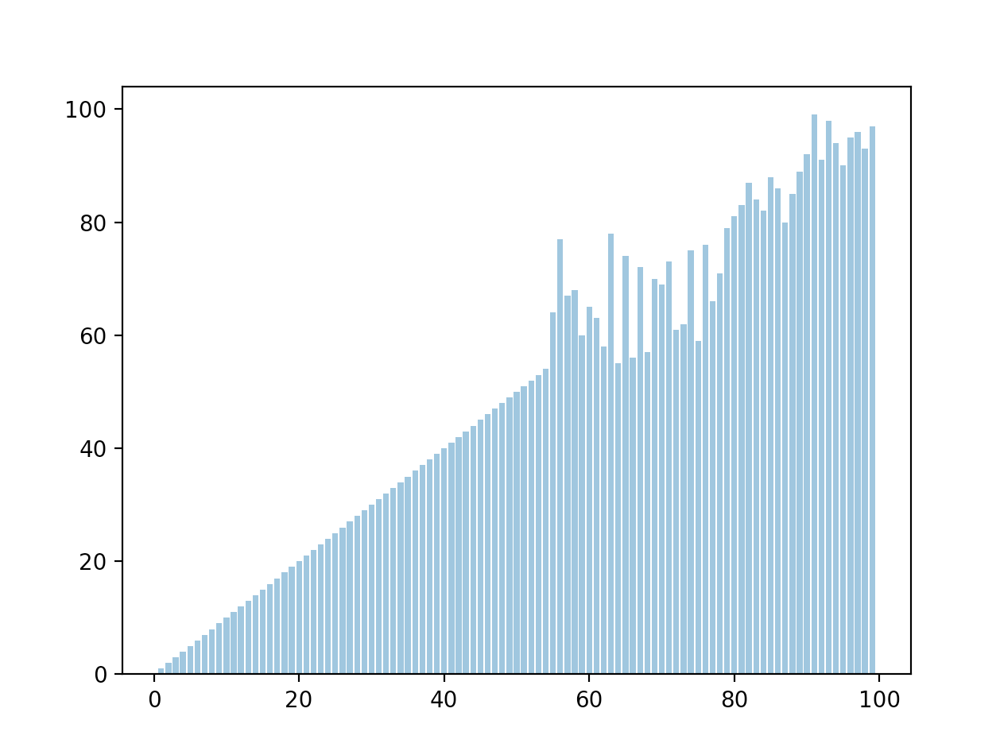

# Sorting-Visualization

Python project for visualizing sorting algorithms.

Dependencies: python3, matplotlib

Installation: 
    git clone https://github.com/ConnorBach/Sorting-Visualization
    chmod +x main.py
    ./main.py -h

Usage:
    main.py -a [ALGORITHM] -n [SIZE OF DATA] -g [ENABLE GRAPH]

    Pass True to the -g flag for animation

Benmarking:
    chmod +x benchmark.py
    ./benchmark.py 

    Outputs table with swaps and time for each algorithm on 4 trials
    10, 100, 1000, 10000 elements

    
Created by Connor Bach and Patrick Fischer
