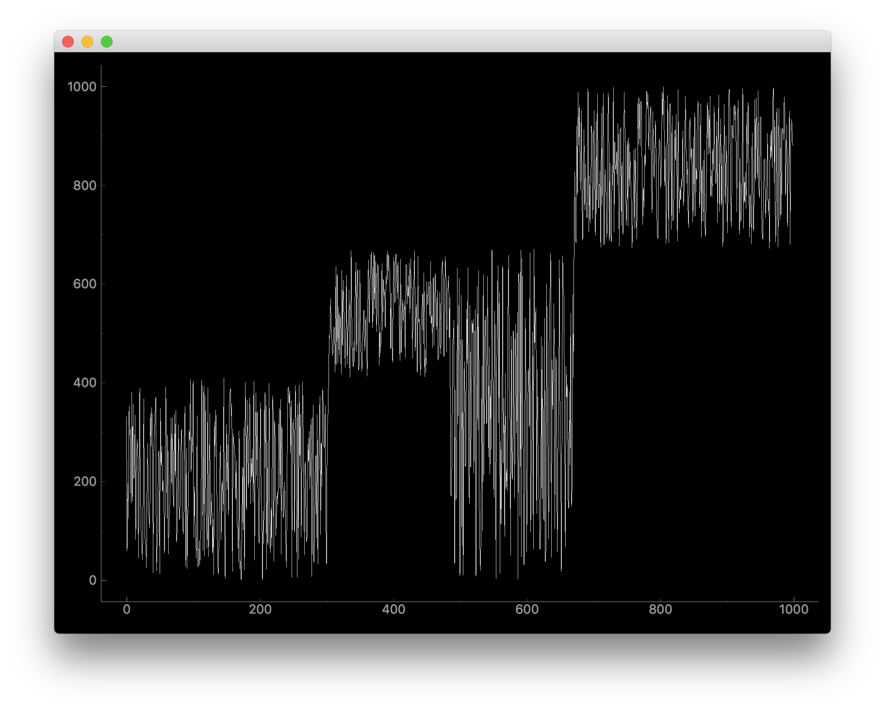

# Sorting-Visualization

Python project for visualizing sorting algorithms.

Dependencies: python3, pyqtgraph

Installation:
	git clone https://github.com/ConnorBach/Sorting-Visualization

```bash
chmod +x main.py
./main.py -h
```

OPTIONS:

	-a [algorithm]      Sorting algorithms available:
			0. Default
			1. Insertion
			2. Quick
			3. Merge Recursive
			4. Selection
			5. Bubble (NOT COMPLETE)
			6. Shell (NOT COMPLETE)
			7. Default (NOT COMPLETE)
			8. Merge In Place (NOT COMPLETE)
			9. Heap Sort (NOT COMPLETE)

	-n [size]           Size of data provided
	-g                  Enables graphing component
	-h                  Displays usage

EXAMPLE USAGE:

```bash
./main.py -a 2 -n 1000 -g
```

Benmarking:

```bash
chmod +x benchmark.py
./benchmark.py
```

Outputs table with swaps and time for each algorithm on 4 trials
10, 100, 1000, 10000 elements



Created by: Connor Bach and Patrick Fischer
Modified by: Michael Orwin
